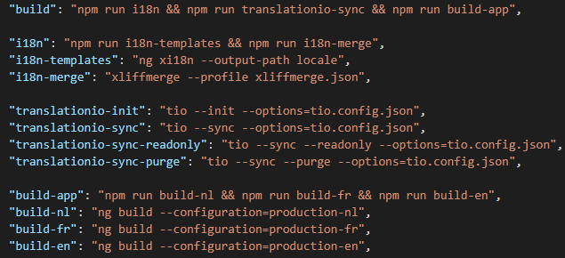

# Translation.io for Angular

Add this package to localize your Angular application.<br />

Il permet de simplifier la traduction des fichiers XLIFF 1.2 en passant par une interface **simple** et **épurée**.<br />
Aucune modification des fichiers XLIFF n'est nécessaire.<br />

Ce package fonctionne avec les versions récentes d'Angular. <br />
Il a été testé avec les versions 6, 7, 8 & 9.<br />
Il supporte uniquement les versions XLIFF 1.2.

Si vous avez besoin de plus d'informations sur l'internationalisation, veuillez consulter la [documentation officielle](https://angular.io/guide/i18n).


## Table of contents
* [Avant de commencer](#avant-de-commencer)
    * [Générer les fichiers XLIFF](#generer-les-fichiers-XLIFF)
    * [Xliffmerge](#xliffmerge)
* [Installation](#installation)
* [Type de traduction](#type-de-traduction)
* [Configuration](#configuration)
* [Usage](#usage)
    * [Init](#init)
    * [Sync](#sync)
    * [Sync & Purge](#sync-&-purge)
    * [Sync & Readonly](#sync-&-readonly)
* [Exemple](#exemple)
* [License](#license)

<br />

## Avant de commencer

### Générer les fichiers XLIFF
Pour utiliser le package ngx-translation-io, il faut posséder les différents fichier xliffs. <br />
Un fichier par langue.

Afin de générer ces fichiers, il y a deux étapes :
1. Générer le fichier de traductions de base avec la commande que fourni Angular (xi18n) ===> "i18n-template".
2. Pour chaque langue de votre site, générer le bon fichier de traduction XLIFF avec le package [xliffmerge](#xliffmerge) ===> "i18n-merge"

Pour ce faire, il suffit d'ajouter ces commandes dans le package.json de votre Angular application
```json
    "i18n-templates": "ng xi18n --output-path locale",
    "i18n-merge": "xliffmerge --profile xliffmerge.json",
```
- `i18n-templates` : Cette commande permet de générer le fichier de traduction en fonction des balises i18n présentes dans votre site
- `i18n-merge` : Grâce au fichier précedemment créé par "i18n-template", cette commande permet de générer, pour chaque langues, le bon fichier de traduction

et de les exécuter, dans cet ordre, grâce à une commande commune :
```json
    "i18n-exec": "npm run i18n-templates && npm run i18n-merge",
```

### Xliffmerge
Il est nécessaire d'utiliser le package [xliffmerge](https://github.com/martinroob/ngx-i18nsupport/wiki/Tutorial-for-using-xliffmerge-with-angular-cli) afin de générer correctement et facilement les différents fichiers de traductions nécessaires au bon fonctionnement de ce package.

Voici les options à configurer pour le package xliffmerge :

Fichier : 'xliffmerge.json'
```js
{
  "xliffmergeOptions": {
    "srcDir": "src/locale",
    "genDir": "src/locale",
    "useSourceAsTarget": true,
    "defaultLanguage": "fr",
    "beautifyOutput": true,
    "languages": ["fr", "en", "nl"],
    "i18nFile": "messages.xlf",
  }
}
```
La propriété "languages" est la seule propriétée qui doit réellement être modifiée en fonction de votre configuration :
- `languages` : Les différentes langues de votre site
    - Exemples : 
        - le site est en français, anglais et néerlandais ===> ["fr", "en", "nl"]
        - le site est en anglais et espagnol ===> ["en", "es"]
- `i18nFile` : Le nom du fichier généré par la commande "i18n-templates"

<br />

## Installation

Une fois que vous avez vos fichiers de traductions, il suffit d'installer le package NPM et de le configurer

```bash
npm i @corellia/ngx-translation-io@latest
```

<br />

## Type de traduction

Il est important de savoir qu'il y a deux types de traductions sur Translation.io. <br />
Une traduction de type "KEY" et une traduction de type "SOURCE".

Si vous décidez d'utiliser les tags "i18n" avec des [id personnalisés](https://angular.io/guide/i18n#set-a-custom-id-for-persistence-and-maintenance),
c'est que vous dirigez vers l'approche de type "KEY".

#### Key 
- Il se base sur un id que vous lui donnez.
- Cet id doit obligatoirement commencer par l'*[i18n_key](#configuration)*
- Pour modifier le contenu "Hello key", il faut obligatoirement utiliser l'interface graphique Translation.io.
- Exemple :
```html
    <div i18n="@@TIO_MYAPP_HelloKey">Hello key</div>
```
>Attention : Si vous ne commencez pas vos [id personnalisés](https://angular.io/guide/i18n#set-a-custom-id-for-persistence-and-maintenance) 
par l'*[i18n_key](#configuration)*, vos traductions seront traitées comme étant des traductions de type **"SOURCE"** et non de type **"KEY"**.

#### Source
- Il se base sur son contenu, son texte.
- Aucun id ne doit être spécifié, il suffit de mettre le tag "i18n".
- Pour modifier le contenu "Hello source", il suffit de changer le texte présent dans la balise.
    -   Une fois modifiée, la source devient alors une "nouvelle" traduction qu'il faut aller traduire dans Translation.io
- Exemple
```html
    <div i18n>Hello source</div>
```

<br />

## Configuration

Go to your Translation.io account page and create a new project.
Once the project is created, you'll have to create a configuration file in the root folder of your Angular app

Fichier : 'tio.config.json'
```js
{
    "api_key": "aaaaaaaaaaaaaaaaaaaaaaaaaaaaaaaa",
    "i18n_key": "TIO",
    "source_language": {
        "language": "fr-BE",
        "file": "./src/assets/locale/messages.fr.xlf"
    },
    "target_languages": [
        {
            "language": "en",
            "file": "./src/assets/locale/messages.en.xlf"
        },
        {
            "language": "nl-BE",
            "file": "./src/assets/locale/messages.nl.xlf"
        }
    ]
}
````
- `api_key` : La clé API votre projet Translation.io
- `i18n_key` : Préfix à utiliser pour chaque traduction qui utilise le système "KEY".<br /> Si le préfix n'est pas correct ou indiqué, la traduction est définie comme type "SOURCE"
    ```html
        <div i18n="@@TIOHelloWorld"></div>      <!-- GOOD   ->  Traduction de type "KEY" -->
        <div i18n="@@Goodbye"></div>            <!-- WRONG  ->  Traduction de type "SOURCE" -->
        <div i18n="@@TI_O_Goodbye"></div>       <!-- WRONG  ->  Traduction de type "SOURCE" -->
    ```
- `source_language` : La configuration de la source. Il faut renseigner le code de la langue et l'emplacement du fichier correspondant.
    - `language` : Le code de la langue source. (Le code doit être le même que celui indiqué dans Translation.io)
    - `file` : Where is located your source xliff file
- `target_languages` : La configuration des targets, c'est à dire, les autres langues du site. Pour chaque target, Il faut renseigner le code de la langue et l'emplacement du fichier correspondant.
    - `language` : Le code de la langue target. (Le code doit être le même que celui indiqué dans Translation.io)
    - `file` : Where is located your target xliff file

<br />

## Usage

#### Init

Itialize your project and push existing translations to Translation.io with:

```bash
tio --init --options=tio.config.json
```
Cette commande est, en principe, utilisé qu'une seule fois par projet. Elle permet d'initialiser les traductions existantes dans Translation.io.<br />
Pour toutes les autres actions, voir le SYNC

#### Sync

To send new translatable keys/strings and get new translations from Translation.io, simply run:

```bash
tio --sync --options=tio.config.json
```

#### Sync & Purge

If you need to remove unused keys/strings from Translation.io, using the current application as reference.

```bash
tio --sync --purge --options=tio.config.json
```

As the name says, this operation will also perform a sync at the same time.

Warning : all keys that are not present in the current application will be **permanently deleted from Translation.io**.

#### Sync & Readonly

Si vous avez besoin de synchroniser sans modifier les données présentes dans Translation.io

```bash
tio --sync --readonly --options=tio.config.json
```
La librairie va récupérer les traductions existantes sans 
- ajouter les nouveaux segments
- mettre à jours les segments présents

<br />

## Exemple

Voici un exemple complet pour build une application dans chaque langue.

Rien de plus simple, il suffit de lancer une commande :
```bash
npm run build
```


<br />

## Licence
The MIT License (MIT). Please see [License File](LICENSE) for more information.